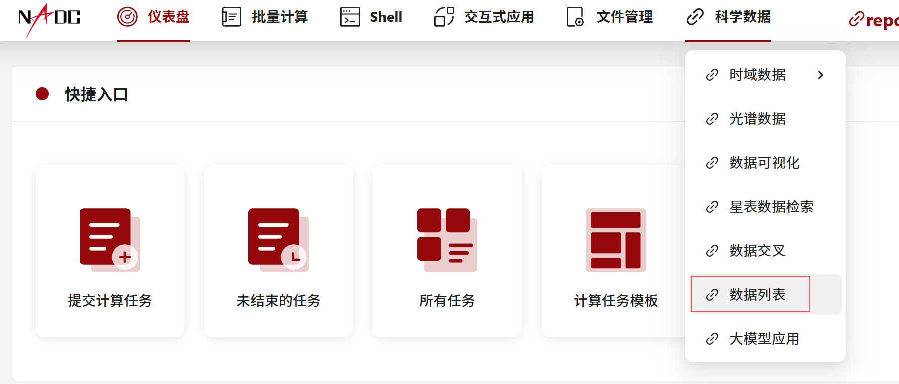
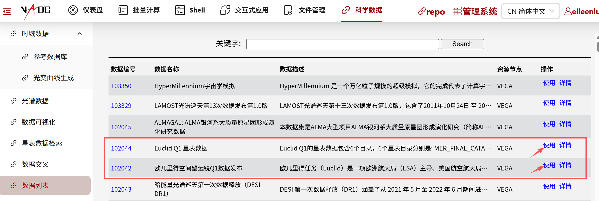
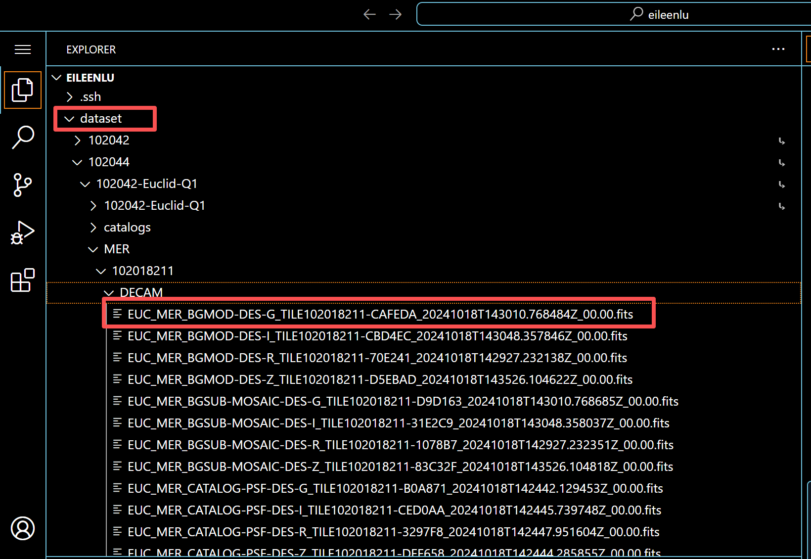
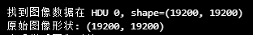

<div align="center">

[](./requirements.txt)
[](#)
[](#)
[](#)
[](#)
[](#)
[](https://nadc.china-vo.org/mwr/euclid-imagecutout/)

# Euclid 图像切割服务使用指南

[English](./README.md) | [中文](./README_CN.md)

</div>

## 项目概述

Euclid Image Cutout Service 是一个基于 Flask 的 Web 应用，用于从 Euclid Q1 等天文数据集中批量裁剪目标天体图像。用户上传包含天体坐标的 FITS 星表后，服务会根据所选仪器、波段、文件类型和裁剪尺寸自动执行切图任务，并提供任务状态跟踪、结果下载和波段缓存能力。

本仓库对应的在线服务已经部署在国家天文科学数据中心平台：

<https://nadc.china-vo.org/mwr/euclid-imagecutout/>

主要功能包括：

- 批量上传 FITS 星表并处理多个天体目标
- 支持 Euclid 及相关巡天数据的多仪器、多波段选择
- 支持 BGSUB、CATALOG-PSF、FLAG、BGMOD、RMS 等文件类型
- 支持波段缓存，避免对相同目标重复切图
- 支持任务进度查询和 ZIP 结果下载
- 支持并行处理以提升批量任务效率

## Euclid 原始数据获取流程

### 方式一：Euclid 官方数据发布页面

Euclid Q1 数据可以从 Euclid 官方数据发布页面获取：

<https://www.cosmos.esa.int/web/euclid/euclid-q1-data-release>

该入口适合了解 Euclid Q1 数据发布背景、官方说明、数据产品类型和引用信息。

### 方式二：国家天文科学数据中心科学平台

国内用户也可以通过国家天文科学数据中心科学平台访问 Euclid 原始数据：

<https://science.china-vo.org/>

在平台中搜索或进入 Euclid 相关数据集后，可以看到 Euclid 原始数据资源。





进入数据集页面后，点击“使用”，创建新的应用。平台会自动将数据挂载到用户自己的工作目录中，通常位于：

```text
dataset/
```



挂载后的 `dataset/` 目录中包含对应的 Euclid FITS 文件，可以直接在平台的 Linux 环境中读取，也可以从 Windows 端通过 SFTP 方式远程读取。

## Euclid 原始图像读取

Euclid 原始图像通常以 FITS 文件形式存储。读取 FITS 文件时推荐使用 `astropy.io.fits`。如果数据位于远程 Linux 服务器，可以在 Windows 环境中通过 `paramiko` 建立 SFTP 连接读取；如果代码直接运行在数据所在的 Linux 环境中，则可以直接读取本地路径。

### Windows 读取 Linux 服务器数据

```python
import io

import paramiko
from astropy.io import fits

hostname = "你的 Linux 服务器 IP"
host_port = 端口号
username = "用户名"
password = "密码"
remote_path = "服务器上数据路径，可批量读取"

transport = paramiko.Transport((hostname, host_port))
transport.connect(username=username, password=password)

sftp = paramiko.SFTPClient.from_transport(transport)
with sftp.open(remote_path, "rb") as f:
    file_content = f.read()

hdul = fits.open(io.BytesIO(file_content))
data = hdul[0].data
print(data.shape)

hdul.close()
sftp.close()
transport.close()
```

### Linux 环境直接读取 FITS

```python
from astropy.io import fits

file_path = "服务器路径"

hdul = fits.open(file_path)
data = hdul[0].data
print(data.shape)
hdul.close()
```

读取成功后，可以通过 `data.shape` 检查图像数组维度。



## Euclid 原始图像可视化

大型 FITS 图像通常体积较大，直接显示会消耗较多内存。建议先从 FITS 的不同 HDU 中寻找二维数值图像数据，再进行降采样、异常值处理和灰度图显示。

```python
from astropy.io import fits
import matplotlib.pyplot as plt
import numpy as np

file_path = (
    "/data/home/XXXXX/dataset/102042/MER/102018667/DECAM/"
    "EUC_MER_BGSUB-MOSAIC-DES-G_TILE102018667-290101_"
    "20241018T151030.012482Z_00.00.fits"
)

hdul = fits.open(file_path, memmap=True)

data = None
for i, hdu in enumerate(hdul):
    if hdu.data is not None:
        if hasattr(hdu.data, "dtype") and hdu.data.dtype.kind in "uifc":
            if len(hdu.data.shape) >= 2:
                data = hdu.data
                print(f"找到图像数据在 HDU {i}, shape={data.shape}")
                break

if data is None:
    print("未找到合适的图像数据，尝试转换...")
    if hdul[0].data is not None and hdul[0].data.dtype == object:
        data = np.array(hdul[0].data.tolist(), dtype=np.float32)
        print(f"转换后的数据形状: {data.shape}")

if data is not None:
    downsample_factor = 10

    if data.ndim > 2:
        data = data[0]

    print(f"原始图像形状: {data.shape}")

    data_small = data[::downsample_factor, ::downsample_factor]
    print(f"降采样后图像形状: {data_small.shape}")

    data_small = np.array(data_small, dtype=np.float32)
    data_small = np.nan_to_num(data_small, nan=0.0, posinf=0.0, neginf=0.0)

    vmin, vmax = np.percentile(data_small, (2, 98))

    plt.figure(figsize=(10, 8))
    plt.imshow(
        data_small,
        cmap="gray",
        origin="lower",
        vmin=vmin,
        vmax=vmax,
    )
    plt.colorbar(label="Intensity")
    plt.title(f"Downsampled FITS Image, factor={downsample_factor}")
    plt.xlabel("X Pixel")
    plt.ylabel("Y Pixel")
    plt.show()
else:
    print("无法读取图像数据")

hdul.close()
```

这段代码的处理逻辑是：

1. 遍历 FITS 文件中的 HDU，寻找可用于显示的二维数值图像数据。
2. 对高维数据取第一个二维切片。
3. 使用固定倍数降采样，降低内存占用和渲染压力。
4. 将异常值、`NaN` 和无穷值转换为可显示数值。
5. 使用 2% 到 98% 分位数作为显示范围，提升图像对比度。

## Euclid 原始图像切割服务

本仓库整理的服务用于将 Euclid 原始 FITS 图像按目标坐标批量切割。用户不需要在本地部署完整数据集，可以直接访问在线服务：

<https://nadc.china-vo.org/mwr/euclid-imagecutout/>

服务的典型使用流程如下：

1. 上传 FITS 格式星表。
2. 指定 RA 和 DEC 列名，默认列名为 `RA` 和 `DEC`。
3. 选择文件类型，例如 `BGSUB`、`CATALOG-PSF`、`FLAG`、`BGMOD`、`RMS`。
4. 选择仪器，例如 `VIS`、`NISP`、`DECAM`、`HSC`、`GPC`、`MEGACAM`。
5. 根据仪器选择可用波段。
6. 设置并行处理线程数，默认值为 4。
7. 提交任务，等待处理完成后下载 ZIP 结果。

## 本地部署说明

### 环境要求

- 操作系统：Linux，推荐 Ubuntu 18.04+
- Python：3.6+
- 依赖：见 [requirements.txt](./requirements.txt)
- 数据要求：服务器需要预置或挂载 Euclid Q1 数据集
- 平台支持：感谢国家天文科学数据中心提供平台支持

### 安装步骤

1. 克隆或下载项目代码。

2. 安装依赖：

```bash
pip install -r requirements.txt
```

3. 配置数据路径。

在 [Euclid_flash_app.py](./Euclid_flash_app.py) 中配置以下路径：

```python
DATA_ROOT = Path("/data/astrodata/mirror/102042-Euclid-Q1")
UPLOAD_DIR = "/data/home/xiejh/app_data/"
PERMANENT_DOWNLOAD_DIR = "/data/home/xiejh/Euclid_download/"
```

4. 启动服务：

```bash
python Euclid_flash_app.py
```

## 星表格式要求

当前服务只支持上传 FITS 格式星表。星表必须包含坐标列，或包含可通过界面手动指定的坐标列。

必需列：

- `RA`：天体赤经，单位为十进制度
- `DEC`：天体赤纬，单位为十进制度

可选列：

- `TARGETID`：目标天体唯一标识。如果提供该列，系统会优先使用它匹配波段缓存文件。

示例：

| TARGETID | RA        | DEC     |
|----------|-----------|---------|
| 12345    | 150.12345 | 2.34567 |
| 12346    | 150.23456 | 2.45678 |
| 12347    | 150.34567 | 2.56789 |

限制：

- 文件格式：FITS
- 行数限制：最多支持 10,000 行
- 文件大小：没有严格限制，但过大的星表会增加上传和处理时间

## 波段缓存机制

波段缓存用于保存已经完成的切图结果，避免相同目标在后续任务中重复处理。系统会将结果按波段分类保存到缓存目录中，后续任务如果命中缓存，可以直接复用已生成文件。

缓存目录示例：

```text
/data/home/xiejh/Euclid_download/
|-- VIS/
|-- NIR-Y/
|-- NIR-J/
|-- NIR-H/
|-- DES-G/
|-- DES-R/
|-- DES-I/
|-- DES-Z/
`-- ...
```

缓存检索规则：

1. 根据 `TARGETID` 匹配文件名中包含相同 ID 的文件。
2. 根据文件类型标识识别对应文件类型。
3. 通过缓存文件所在目录判断所属波段。

缓存优先级：

1. 先检查波段缓存目录中是否存在匹配文件。
2. 命中缓存时直接复用缓存文件。
3. 未命中缓存时执行正常切图流程。
4. 处理完成后将结果备份到对应波段缓存目录。

## 后端 API

### 上传文件

```http
POST /api/upload_file
Content-Type: multipart/form-data
```

参数：

- `catalog`：FITS 格式星表文件

响应示例：

```json
{
  "success": true,
  "temp_id": "temporary_file_id",
  "filename": "uploaded_filename",
  "message": "File uploaded successfully"
}
```

### 提交任务

```http
POST /api/submit_task
Content-Type: application/json
```

参数示例：

```json
{
  "temp_id": "temporary_file_id",
  "ra_col": "ra_column_name",
  "dec_col": "dec_column_name",
  "size": 128,
  "file_types": ["BGSUB", "CATALOG-PSF"],
  "instrument": "VIS",
  "bands": ["VIS"],
  "n_workers": 4
}
```

响应示例：

```json
{
  "success": true,
  "task_id": "task_id",
  "message": "Task submitted"
}
```

### 查询任务状态

```http
GET /api/task_status?task_id=task_id
```

响应示例：

```json
{
  "task_id": "task_id",
  "status": "completed",
  "progress": 100,
  "message": "Task processing completed",
  "result_url": "download_url"
}
```

`status` 的常见取值包括 `queued`、`processing`、`completed` 和 `failed`。

## 常见问题

### 文件上传失败

- 确认上传文件为 FITS 格式。
- 检查文件大小，过大的文件可能需要更长上传时间。

### 任务处理失败

- 检查星表格式是否正确，尤其是 RA 和 DEC 列。
- 确认所选仪器和波段组合有效。
- 查看服务端日志获取详细错误信息。

### 缓存文件未匹配

- 确认星表中包含正确的 `TARGETID` 列。
- 检查缓存文件命名是否包含对应 `TARGETID`。

## 性能优化建议

1. 批量处理大量目标时，可以适当增加并行工作数 `n_workers`。
2. 优先使用波段缓存机制，减少重复切图。
3. 对经常处理的目标，建议提供 `TARGETID` 以提高缓存命中率。
4. 正式处理前，可以先检查缓存目录中已有文件状态。

## 作者信息

Euclid 数据获取、原始图像读取与图像切割流程由以下作者整理和维护：

- 谢锦晖：<xiejinhui22@mails.ucas.ac.cn>
- 陆海凌：<luhl@nao.cas.cn>
- 李旭：<yananfeng2002@gmail.com>

## 技术支持

如有问题或建议，请联系项目维护者。
